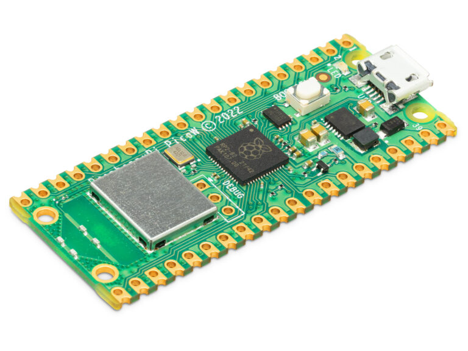
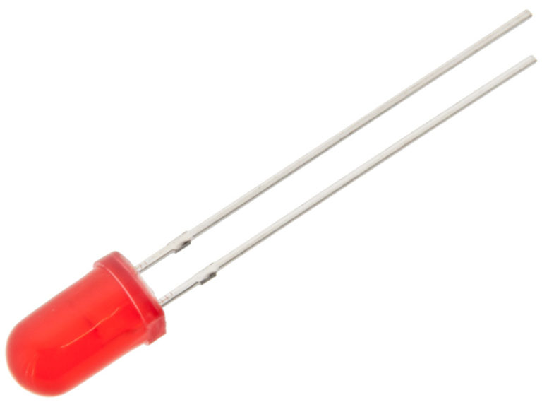
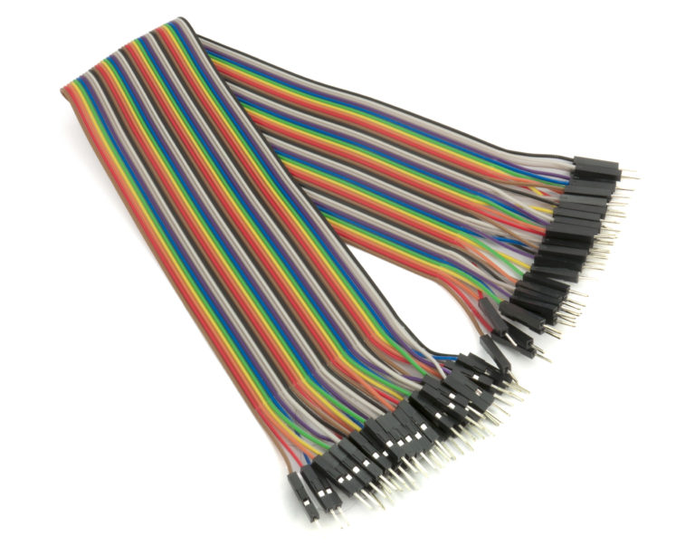
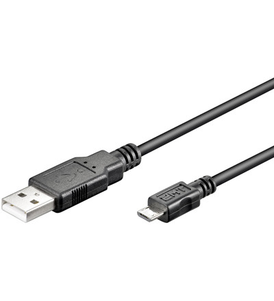
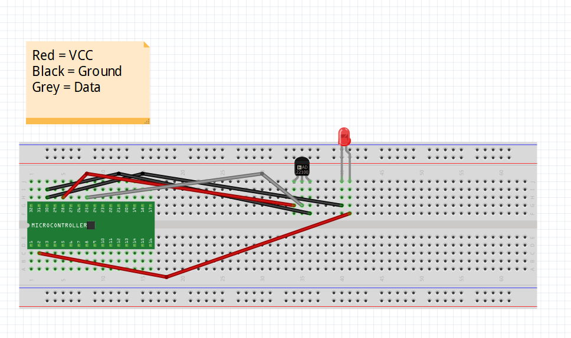
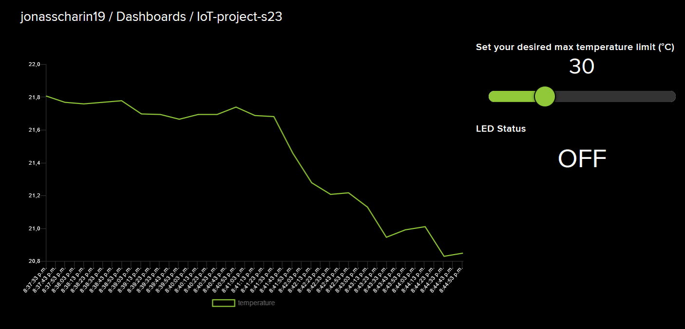

# Iot-Project-S23
Name: Jonas Scharin

Student ID: js226yd

## Overview
This project monitors the temperature and uses a LED and a discord bot to notify when the temperature has exceeded a upperbound which is dynamically set by the user. For someone with a basic knowledge of programming, webhooks, git and breadboards following this tutorial and setting up the project should not take more than an hour.

## Objective
I have chosen to do create this device to in a fun and rewarding way learn about "Internet of Things. Why this specific project was chosen is because I want to be able to monitor and control the temperature in my home in a preemptive way, which in this case means that the user should have a greater awarness of the the temperature in a specific environment. The temperature upper bound which is dynamically set by the user serves as a threshold. When the threshold is exceeded the user will be informed by a lit up LED and a notification on discord. This feature helps the user have greater control over the environment.

Example: User does not want the temperature in its appartment to exceed 30 degrees so it sets the upper bound to 30 degrees. When the upper bound is passed the user will be informed and can take actions such as opening a window, turning on a fan e.t.c to keep the temperature below its upper bound.

## Material
The Rasberry Pi Pico W is the microcontroller used for this project. See datasheet [here](https://datasheets.raspberrypi.com/picow/pico-w-datasheet.pdf).

The MCP9700 TO-92 Temperature sensor has a range of -40° - 125°C, which works fine for this project as long as your not monitoring extreme environments. The sensor outputs linear voltage (analog).

I have chosen to use a 5mm red diffuse 1500mcd LED to turn on when the temperature has exceeded its upper bound. The choice of LED here is not strict at all.

To connect all the components I have used 30cm male/male jumper wires and a 840 tie-point breadboard. An alternative option here would be to buy male/female wires and connect them directly to the components, this would remove the need of a breadboard and give the device increased flexibility.

To connect to the Rasberry Pi Pico W to my computer I used a 1.8 meter A-male to MicroB USB cable.

| Hardware | Picture | Link |
| -------- | ------- | ---- |
| Rasberry Pi Pico W |  | [Electrokit link](https://www.electrokit.com/en/product/raspberry-pi-pico-w/) |
| MCP9700 TO-92 Temperature sensor |  | [Electrokit link](https://www.electrokit.com/en/product/mcp9700-e-to-to-92-temperature-sensor/) |
| LED 5mm red diffuse 1500mcd |  | [Electrokit link](https://www.electrokit.com/en/product/led-5mm-rod-diffus-1500mcd/) |
| Solderless Breadboard 840 tie-points |  | [Electrokit link](https://www.electrokit.com/en/product/solderless-breadboard-840-tie-points-2/) |
| Jumper wires 40-pin 30cm male/male |  | [Electrokit link](https://www.electrokit.com/en/product/jumper-wires-40-pin-30cm-male-male/) |
| USB cable A-male – microB-male 1.8m |  | [Electrokit link](https://www.electrokit.com/en/product/usb-cable-a-male-microb-male-1-8m/) |

## Computer Setup
The chosen IDE for this project is Visual Studio Code with the Pico-w-go extension (with MicroPython firmware) which is used to upload code to the Pico.

## Setup
Donwload Python and Setup VS Code:
1. Download and Install [Python](https://www.python.org/downloads/)
2. Download and Install [Visual Studio Code IDE](https://code.visualstudio.com/download)
3. Install the Pico-w-go extension in Visual Studio Code

Add the MicroPython firmware to the Pico:
1. Download [MicroPython](https://micropython.org/download/)
2. Connect the micro USB end of the cable to the Pico
3. While pressing the BOOTSEL button on the Pico connect the USB cable to your computer
4. If done correctly a new drive should appear called RPI-RP2, insert the uf2 file retrieved when downloading MicroPython into this drive.
5. Wait for the the board to automatically disconnect and reconnect.

## Putting Everything Together
The setup given below is an example of how the different components can be connected.

IMPORTANT THINGS THAT MUST BE CONNECTED PROPERLY
1. Temperature sensor: Ground pin to GND, 3V3(OUT) to Vdd pin and ADC pin to Vout See datasheet for temperature sensor [here](https://www.electrokit.com/uploads/productfile/41011/21942e-2.pdf).
2. LED: GP pin to Anode and Ground pin to Cathode. See datasheet for LED [here](https://www.electrokit.com/uploads/productfile/40307/JSL-502-4030702x.pdf)

Rasberrry Pi Pico W [documentation](https://www.raspberrypi.com/documentation/microcontrollers/raspberry-pi-pico.html)



## Platform
The choice of platform for this project is Adafruit IO. Adafruit IO is a cloud service with focus on ease of use, it provides a easy way to send data to a server and display it without much programming.

Read more about setting up an Adafruit IO [here](https://learn.adafruit.com/adafruit-io-home-security/adafruit-io-setup).

## Code
SendTemperature is the core function of the program, it sends the temperature to our adafruit IO and calls the SendLED. The sendLED function sends the LED status to adafruit and then depending on the LED status and time constraints calls the sendNotification function which signals the program to send a notification.

```
def sendTemperature(client, filter_size):
    global last_temperature_sent_ticks
    
    if ((time.ticks_ms() - last_temperature_sent_ticks) < TEMPERATURES_INTERVAL):
        return; # Too soon since last one sent.

    
    temp = temperature.getTemperature(filter_size)
        
    print("Publishing: {0} to {1} ... ".format(temp, AIO_TEMPERATURE_FEED), end='')
    try:
        client.publish(topic=AIO_TEMPERATURE_FEED, msg=str(temp))
        print("DONE")
    except Exception as e:
        print("FAILED")
    finally:
        last_temperature_sent_ticks = time.ticks_ms()
        sendLED(client, temp)
```
```
def sendLED(client, temp):
    global prev_led_status

    led_status = led.checkMaxTemp(temp)

    if led_status == prev_led_status:
        pass; #no change in data no need to send
    else:
        print("Publishing: {0} to {1} ... ".format(led_status, AIO_LED_FEED), end='')
        try:
            client.publish(topic=AIO_LED_FEED, msg=led_status)
            print("DONE")
        except Exception as e:
            print("FAILED")
        finally:
            prev_led_status = led_status
            
    if led_status == "ON":
        sendNotification(client)
```
```
def sendNotification(client):
    global last_notification_sent_ticks

    if ((time.ticks_ms()/1000 - last_notification_sent_ticks) < NOTIFICATION_INTERVAL and last_notification_sent_ticks != 0):
        return;

    signal = "SEND"

    print("Publishing: {0} to {1} ... ".format(signal, AIO_NOTIFICATION_FEED), end='')
    try:
        client.publish(topic=AIO_NOTIFICATION_FEED, msg=signal)
        print("DONE")
    except Exception as e:
        print("FAILED")
    finally:
        last_notification_sent_ticks = time.ticks_ms()/1000
```

The function getTemperature takes a filter_size as parameter which defines how many temperatures the function will take the average of and return as the temperature value. 
```
def getTemperature(filter_size):
    
    adc = machine.ADC(27)
    sf = 4095/65535 # Scale factor
    volt_per_adc = (3.3 / 4095)

    temp = 0
    i = 0

    while i < filter_size:
        millivolts = adc.read_u16()

        adc_12b = millivolts * sf

        volt = adc_12b * volt_per_adc

        # MCP9700 characteristics
        dx = abs(50 - 0)
        dy = abs(0 - 0.5)

        shift = volt - 0.5

        temp += (shift/(dy/dx))/filter_size
        
        i += 1

    return temp

```
In order to dynamically change the temperature upper bound in the adafruit IO. I created a slider which is connected to the tempSlider function. 
```
def tempSlider(topic, msg):
    global templimit
    print((topic, msg))
    templimit = int(msg)
    print("Max temperature set to", templimit)
```
In the main code the client.check_msg looks for interactions with the slider and calls the tempSlider function if a interaction/change occurs. How to connect your Pico W to wifi which is done in the connectToNetwork function can be found [here](https://projects.raspberrypi.org/en/projects/get-started-pico-w/2).
```
    try:
        ip = connect.connectToNetwork()
    except KeyboardInterrupt:
            print("Keyboard interrupt")
        
    client = adafruit.mqttConnectTo()

    try:                      
        while 1:
            client.check_msg()              
            adafruit.sendTemperature(client, filter_size)
    finally:                  
        client.disconnect()   
        client = None
        print("Disconnected from Adafruit IO.")
```
In order to connect to our adafruit IO this function is called, the callback function is. In mqttConnectTo the function tempSlider is set as a callback function which causes the MQTT client to call the method on a sperate thread to the main application thread. The upperbound is hardcoded to its max value 100 at start therefore we publish it directly when we connect. After that we subscribe to the templimit feed in order to recieve data from the slider.  
```
def mqttConnectTo():
    # Use the MQTT protocol to connect to Adafruit IO
    client = MQTTClient(AIO_CLIENT_ID, AIO_SERVER, AIO_PORT, AIO_USER, AIO_KEY)

    client.set_callback(tempSlider)
    client.connect()
    client.publish(topic=AIO_TEMPLIMIT_FEED, msg=str(templimit)) #synchronizes the slider and templimit at start
    client.subscribe(AIO_TEMPLIMIT_FEED)
    print("Connected to %s, subscribed to %s topic" % (AIO_SERVER, AIO_TEMPLIMIT_FEED))
    return client
```

## Transmitting Data
Because theres a limit of how much data can be sent to adafruit IO feeds we need to set certain restricitions. This is done by the variabel TEMPERATURES_INTERVAL (see code for sendTemperature function in section Code) this variabel is set to 20000 milliseconds. This interval also controls the sendLED- and sendNotification functions because they are called inside the sendTemperature method. This interval variable causes the function to only send data with atleast 20 second intervals. NOTIFICATION_INTERVAL is used in the sendNotification (see code for sendNotification function in section Code) this variabel is set to 1800 seconds and makes sure that notifications have atleast a 30 minute interval to avoid spam. These variables can be readjusted but just make sure you avoid sending to much data to the adafruit IO feeds. The tempSlider method sends data when changes in value occurs/interactions with the slider. Make sure not to spam the slider to avoid exceeding the data limit on adafruit IO.  

The wireless protocol used in this project is WiFi and the transport protocol MQTT. In order to send a notification over discord I used a webhook which can be integrated into a discord server. [Here](https://learn.adafruit.com/discord-and-slack-connected-smart-plant-with-adafruit-io-triggers/discord-setup) is how to connect your adafruit IO webhooks to a discord server bot. 

##Presenting The Data

The chart keeps track of all temperatures registered over a 24 hour period, the slider as mentioned is connected to our tempSlider function and sends data to our main program to keep track of the upper bound temperture limit, and the led status keeps track of the LED's status. If the staus is ON it means the LED is turned on and the temperature is currently above its upper limit, if the staus is OFF then the led is off and the temperature has not exceeded its upper bound.

Read more about setting up a adafruit IO dashboard [here](https://learn.adafruit.com/adafruit-io-basics-dashboards/creating-a-dashboard).

The notification will look something like this if done correctly. The message sent by the bot can be set to whatever, as seen in the picture below you can either send a fitting music video or a more formal message! 


## Finalizing the Design


